# 🚀 CI/CD Implementation Guide
## ML Trading Dashboard - Complete CI/CD Pipeline

---

## Table of Contents

### Quick Start
- [Overview](#overview)
- [2-Minute Setup](#2-minute-setup)
- [Current Implementation](#current-implementation)

### Architecture & Configuration
- [Pipeline Architecture](#pipeline-architecture)
- [GitHub Actions Configuration](#github-actions-configuration)
- [Environment Setup](#environment-setup)

### Testing Framework
- [Testing Strategy](#testing-strategy)
- [Local Development](#local-development)
- [Test Types](#test-types)

### Deployment Options
- [Simple CI (Current)](#simple-ci-current)
- [Docker Deployment](#docker-deployment)
- [Serverless Options](#serverless-options)

### Advanced Features
- [Security & Compliance](#security--compliance)
- [Monitoring & Alerts](#monitoring--alerts)
- [Performance Optimization](#performance-optimization)

### Operations
- [Troubleshooting](#troubleshooting)
- [Best Practices](#best-practices)
- [Roadmap](#roadmap)

---

## Overview

This project implements a comprehensive CI/CD pipeline designed to ensure code quality, prevent regressions, and enable reliable deployments. The current implementation focuses on **automated testing with zero hosting costs**, making it perfect for personal projects while maintaining professional development practices.

### 🎯 **Pipeline Goals**
- **Quality Assurance**: Prevent regressions through comprehensive testing
- **Fast Feedback**: Quick detection of issues on every push
- **Zero Cost**: No hosting fees for basic setup
- **Scalability**: Easy upgrade path to full deployment pipeline
- **Security**: Automated security scanning and compliance

### 📊 **Current Metrics**
- **Test Execution**: < 5 minutes for full suite
- **Test Coverage**: > 80% code coverage target
- **Feedback Time**: Issues detected within 2-3 minutes
- **Cost**: $0 for basic CI implementation

---

## 2-Minute Setup

### ⚡ **Quick Start**
```bash
# 1. Tests run automatically on every push
git add .
git commit -m "Initial CI setup"
git push  # → Triggers automated tests
```

### 🎯 **What Happens**
| Event | Action |
|-------|--------|
| Any Push | Runs all tests automatically |
| Pull Request | Tests must pass before merge |
| Local Dev | Run tests manually with `pytest` |

---

## Current Implementation

The project currently uses a **Simple CI approach** focused on automated testing without deployment complexity.

### ✅ **Active Features**
- ✅ **GitHub Actions** integration
- ✅ **Automated testing** on every push
- ✅ **Regression testing** for UI components
- ✅ **Code coverage** reporting
- ✅ **Quality gates** with test requirements

### 🔄 **Workflow Overview**

```mermaid
graph LR
    A[Code Push] --> B[GitHub Actions]
    B --> C[Install Dependencies]
    C --> D[Run Linting]
    D --> E[Run Tests]
    E --> F[Generate Reports]
    F --> G{Pass?}
    G -->|✅| H[Success]
    G -->|❌| I[Fail & Notify]
```


---

## Pipeline Architecture

### 🏗️ **Full CI/CD Architecture**


### 🔄 **Workflow Triggers**
- **Push to any branch**: Triggers CI validation
- **Pull Request**: Triggers CI + blocks merge on failure
- **Push to `develop`**: Triggers CI + Staging deployment (future)
- **Push to `main`**: Triggers CI + Production deployment (future)

---

## GitHub Actions Configuration

### 📋 **Current CI Workflow**
```yaml
# .github/workflows/ci.yml
name: CI Tests
on: [push, pull_request]

jobs:
  test:
    runs-on: ubuntu-latest
    strategy:
      matrix:
        python-version: ['3.9', '3.10', '3.11']
    
    steps:
      - uses: actions/checkout@v4
      
      - name: Set up Python ${{ matrix.python-version }}
        uses: actions/setup-python@v4
        with:
          python-version: ${{ matrix.python-version }}
      
      - name: Cache dependencies
        uses: actions/cache@v3
        with:
          path: ~/.cache/pip
          key: ${{ runner.os }}-pip-${{ hashFiles('**/requirements.txt') }}
      
      - name: Install dependencies
        run: |
          python -m pip install --upgrade pip
          pip install -r requirements.txt
          pip install pytest pytest-cov flake8 bandit safety
      
      - name: Lint with flake8
        run: |
          flake8 src/ --max-line-length=88 --exclude=__pycache__
      
      - name: Security check with bandit
        run: |
          bandit -r src/ -f json || true
      
      - name: Check dependencies with safety
        run: |
          safety check || true
      
      - name: Run tests with coverage
        run: |
          pytest tests/ -v --cov=src --cov-report=xml --cov-report=term-missing
      
      - name: Upload coverage to Codecov
        uses: codecov/codecov-action@v3
        with:
          file: ./coverage.xml
          fail_ci_if_error: false
```

### 🛠️ **Enhanced CI Configuration** (Optional)
```yaml
# Advanced features for future implementation
      - name: Run regression tests
        run: |
          python run_regression_tests.py --ci-mode
      
      - name: Generate test report
        if: always()
        run: |
          pytest tests/ --html=report.html --self-contained-html
      
      - name: Upload test artifacts
        uses: actions/upload-artifact@v3
        if: always()
        with:
          name: test-results-${{ matrix.python-version }}
          path: |
            report.html
            coverage.xml
            bandit-report.json
```

---

## Environment Setup

### 🔧 **Local Development Setup**
```bash
# 1. Clone and setup environment
git clone <repository>
cd MLTrading

# 2. Create conda environment (preferred)
conda env create -f environment.yml
conda activate trading_env

# 3. Install development dependencies
pip install pytest pytest-cov flake8 bandit safety pre-commit

# 4. Setup pre-commit hooks (optional)
pre-commit install
```

### 📝 **Pre-commit Configuration** (`.pre-commit-config.yaml`)
```yaml
repos:
  - repo: https://github.com/psf/black
    rev: 23.3.0
    hooks:
      - id: black
        language_version: python3.11

  - repo: https://github.com/pycqa/isort
    rev: 5.12.0
    hooks:
      - id: isort

  - repo: https://github.com/pycqa/flake8
    rev: 6.0.0
    hooks:
      - id: flake8
        args: [--max-line-length=88]

  - repo: local
    hooks:
      - id: regression-tests
        name: Quick Regression Tests
        entry: pytest tests/test_dashboard_regression.py -m smoke
        language: system
        pass_filenames: false
```

### 🌍 **Environment Variables**
```bash
# Development
export DASH_DEBUG=True
export PYTHONPATH="${PYTHONPATH}:$(pwd)"

# Testing
export DASH_TESTING=True
export DATABASE_URL=sqlite:///test.db

# Production (when deployed)
export DASH_DEBUG=False
export ENVIRONMENT=production
export DATABASE_URL=postgresql://...
```

---

## Testing Strategy

### 🧪 **Test Pipeline Stages**

#### **Stage 1: Code Quality & Security** (2-3 minutes)
**Checks**:
- **Code Formatting**: Black, isort
- **Linting**: Flake8 (style and syntax)
- **Security Scanning**: Bandit (SAST)
- **Dependency Vulnerabilities**: Safety check

#### **Stage 2: Unit Testing** (2-3 minutes)
```bash
# Service layer tests
pytest tests/unit/dashboard/test_technical_summary.py --cov=src/dashboard/services

# Utility tests
pytest tests/unit/indicators/test_technical_indicators.py --cov=src/utils

# API tests
pytest tests/unit/test_api_error_handling.py --cov=src/api
```

#### **Stage 3: Integration Testing** (3-5 minutes)
```bash
# Dashboard component integration
pytest tests/test_dashboard_regression.py -v

# API integration
pytest tests/integration/test_api_integration.py -v

# Callback regression tests
pytest tests/test_callback_regression.py -v
```

### 📊 **Test Coverage Requirements**
- **Minimum**: 70% overall coverage
- **Target**: 80% overall coverage
- **Critical Components**: 90% coverage required
  - `src/dashboard/services/`
  - `src/dashboard/callbacks/`
  - `src/api/routes/`

---

## Local Development

### 🚀 **Running Tests Locally**
```bash
# Run all tests
pytest

# Run with coverage
pytest --cov=src --cov-report=html

# Run specific test categories
pytest tests/unit/                           # Unit tests only
pytest tests/integration/                    # Integration tests only
pytest tests/test_dashboard_regression.py    # UI regression tests

# Run regression tests with custom script
python run_regression_tests.py

# Quick smoke tests (fast subset)
pytest -m smoke

# Skip slow tests during development
pytest -m "not slow"
```

### 🔍 **Test Types**
- **Unit Tests**: Individual function/class testing
- **Integration Tests**: Component interaction testing
- **Regression Tests**: UI workflow and callback testing
- **Performance Tests**: Speed and memory benchmarks
- **Security Tests**: Vulnerability and compliance testing

### 🛠️ **Development Workflow**
```bash
# 1. Create feature branch
git checkout -b feature/new-feature

# 2. Write tests first (TDD)
# 3. Implement feature
# 4. Run tests locally
pytest tests/

# 5. Check coverage
pytest --cov=src --cov-report=term-missing

# 6. Commit and push
git add .
git commit -m "feat: add new feature with tests"
git push origin feature/new-feature

# 7. Create PR (triggers CI automatically)
```

---

## Simple CI (Current)

### ✅ **Benefits of Current Approach**
- **Zero Cost**: No hosting or deployment fees
- **Simple Setup**: Minimal configuration required
- **Quality Assurance**: Automated testing on every change
- **Fast Feedback**: Know immediately if code breaks
- **Professional Standards**: Industry-standard CI practices

### 🎯 **Perfect For**
- Personal projects and portfolios
- Learning and experimentation
- Open source contributions
- MVP development
- Code quality demonstration

### 📊 **GitHub Integration Features**
- ✅ **Green checkmarks** when tests pass
- ❌ **Red X marks** when tests fail
- 📈 **Test coverage reports** in PR comments
- 🔔 **Email notifications** on failures
- 📱 **Status badges** for README

### 📱 **Status Badge**
Add to your README.md:
```markdown

[](https://codecov.io/gh/your-username/MLTrading)
```

---

## Docker Deployment

### 🐳 **Docker Configuration**
```dockerfile
# Dockerfile
FROM python:3.11-slim

# Set working directory
WORKDIR /app

# Install system dependencies
RUN apt-get update && apt-get install -y \
    gcc \
    && rm -rf /var/lib/apt/lists/*

# Copy requirements and install Python dependencies
COPY requirements.txt .
RUN pip install --no-cache-dir -r requirements.txt

# Copy application code
COPY src/ ./src/
COPY static/ ./static/

# Expose port
EXPOSE 8050

# Health check
HEALTHCHECK --interval=30s --timeout=30s --start-period=5s --retries=3 \
  CMD curl -f http://localhost:8050/health || exit 1

# Run application
CMD ["gunicorn", "--bind", "0.0.0.0:8050", "--workers", "4", "src.dashboard.app:server"]
```

### ☸️ **Kubernetes Deployment**
```yaml
# k8s-deployment.yml
apiVersion: apps/v1
kind: Deployment
metadata:
  name: mltrading-dashboard
spec:
  replicas: 3
  selector:
    matchLabels:
      app: mltrading-dashboard
  template:
    metadata:
      labels:
        app: mltrading-dashboard
    spec:
      containers:
      - name: dashboard
        image: mltrading:latest
        ports:
        - containerPort: 8050
        env:
        - name: DATABASE_URL
          valueFrom:
            secretKeyRef:
              name: db-secret
              key: url
        resources:
          requests:
            memory: "256Mi"
            cpu: "250m"
          limits:
            memory: "512Mi"
            cpu: "500m"
        livenessProbe:
          httpGet:
            path: /health
            port: 8050
          initialDelaySeconds: 30
          periodSeconds: 10
        readinessProbe:
          httpGet:
            path: /health
            port: 8050
          initialDelaySeconds: 5
          periodSeconds: 5
```

---

## Serverless Options

### ☁️ **Cloud Functions Deployment**
**Platforms**:
- AWS Lambda + API Gateway
- Google Cloud Functions
- Azure Functions
- Vercel Functions

**Trade-offs**:
- ✅ Cost-effective for low traffic
- ✅ Auto-scaling and zero maintenance
- ❌ Cold start latency (2-5 seconds)
- ❌ Complexity with Dash applications
- ❌ Limited execution time (15 minutes max)

**Best For**: API endpoints and background processing, not full Dash apps.

---

## Security & Compliance

### 🔒 **Security Scanning Pipeline**

#### **Static Analysis (SAST)**
```bash
# Security scanning in CI
bandit -r src/ -f json -o bandit-report.json
safety check --json --output safety-report.json
semgrep --config=auto src/
```

#### **Dependency Scanning**
```bash
# Automated dependency vulnerability checks
pip-audit --format=json --output=audit-report.json
safety check --json --output=safety-report.json
snyk test --json > snyk-report.json
```

#### **Container Scanning** (if using Docker)
```bash
# Docker image security scanning
docker scan mltrading:latest
trivy image mltrading:latest
grype mltrading:latest
```

### 🛡️ **Security Best Practices**

#### **Environment Security**
- Store secrets in environment variables
- Use encrypted databases and connections
- Enable SSL/HTTPS for all environments
- Implement rate limiting and CSRF protection
- Regular security updates and patches

#### **Access Control Configuration**
```python
# Role-based access control
SECURITY_CONFIG = {
    "admin": {
        "can_modify_settings": True,
        "can_view_all_data": True,
        "can_export_data": True
    },
    "analyst": {
        "can_modify_settings": False,
        "can_view_all_data": True,
        "can_export_data": True
    },
    "viewer": {
        "can_modify_settings": False,
        "can_view_all_data": False,
        "can_export_data": False
    }
}
```

### 📋 **Compliance Requirements**

#### **Data Protection**
- GDPR compliance for EU users
- Data encryption at rest and in transit
- Audit logging for data access
- Regular security assessments
- Data retention and deletion policies

#### **Financial Data**
- SOX compliance considerations (if applicable)
- Data retention policies
- Access controls and segregation of duties
- Change management processes
- Audit trails for all data modifications

---

## Monitoring & Alerts

### 📊 **Application Monitoring**

#### **Health Check Endpoint**
```python
# src/dashboard/health.py
from datetime import datetime
from flask import jsonify

@app.server.route('/health')
def health_check():
    try:
        # Database connectivity check
        db_status = check_database_connection()
        
        # External API status
        api_status = check_external_apis()
        
        # Memory usage check
        memory_usage = check_memory_usage()
        
        return jsonify({
            "status": "healthy",
            "timestamp": datetime.utcnow().isoformat(),
            "version": "1.0.0",
            "checks": {
                "database": db_status,
                "external_apis": api_status,
                "memory_usage": memory_usage
            }
        }), 200
    except Exception as e:
        return jsonify({
            "status": "unhealthy",
            "error": str(e),
            "timestamp": datetime.utcnow().isoformat()
        }), 500
```

#### **Performance Monitoring**
```python
# Performance monitoring decorator
import time
import logging
from functools import wraps

def monitor_performance(func):
    @wraps(func)
    def wrapper(*args, **kwargs):
        start_time = time.time()
        try:
            result = func(*args, **kwargs)
            duration = time.time() - start_time
            logging.info(f"{func.__name__} executed successfully in {duration:.2f}s")
            return result
        except Exception as e:
            duration = time.time() - start_time
            logging.error(f"{func.__name__} failed after {duration:.2f}s: {str(e)}")
            raise
    return wrapper
```

### 🚨 **Alerting Strategy**

#### **Alert Levels**
1. **Critical** (Immediate notification)
   - Application down (health check failing)
   - Database connection failures
   - Error rate > 5%
   - Response time > 10 seconds

2. **Warning** (15-minute delay)
   - High memory usage (> 80%)
   - High CPU usage (> 80%)
   - Error rate > 1%
   - Slow response times (> 5 seconds)

3. **Information** (Daily digest)
   - Deployment notifications
   - Performance trends
   - Usage statistics
   - Security scan results

#### **Notification Channels**
```yaml
# alerting.yml
channels:
  critical:
    - slack: "#alerts-critical"
    - email: "admin@company.com"
    - pagerduty: "service-key"
  
  warning:
    - slack: "#alerts-warning"
    - email: "team@company.com"
  
  info:
    - slack: "#deployments"
    - email: "team@company.com"
```

---

## Performance Optimization

### ⚡ **CI Pipeline Optimization**

#### **Speed Improvements**
```yaml
# GitHub Actions optimizations
- name: Cache dependencies
  uses: actions/cache@v3
  with:
    path: ~/.cache/pip
    key: ${{ runner.os }}-pip-${{ hashFiles('**/requirements.txt') }}

- name: Parallel test execution
  run: |
    pytest tests/ -n auto --dist loadscope

- name: Fast linting
  run: |
    flake8 src/ --jobs=auto --statistics
```

#### **Test Optimization**
```bash
# Run tests in parallel
pytest tests/ -n auto

# Skip slow tests during development
pytest -m "not slow"

# Use test markers for organization
pytest -m "unit" -v          # Fast unit tests only
pytest -m "integration" -v   # Integration tests only
pytest -m "smoke" -v         # Critical path tests only
```

### 🎯 **Resource Optimization**
- **Dependency caching**: Reduce installation time
- **Selective testing**: Run only affected tests
- **Parallel execution**: Multiple test workers
- **Smart test selection**: Skip unchanged components

---

## Troubleshooting

### ❌ **Common Issues & Solutions**

#### **Build Failures**
```bash
# Check GitHub Actions logs
gh workflow view --web

# Local debugging
pytest tests/ -v --tb=long
python -c "import src.dashboard.app; print('Import successful')"

# Check Python path issues
export PYTHONPATH="${PYTHONPATH}:$(pwd)"
pytest tests/
```

#### **Test Environment Issues**
```bash
# Python version compatibility
python --version  # Should match CI (3.11)

# Dependency conflicts
pip freeze > current_requirements.txt
diff requirements.txt current_requirements.txt

# Environment variables
echo $PYTHONPATH
echo $DASH_TESTING
echo $DATABASE_URL
```

#### **Performance Issues**
```bash
# Profile test execution
pytest tests/ --durations=10

# Check memory usage
pytest tests/ --profile

# Identify slow tests
pytest tests/ --durations=0 | head -20
```

### 🔧 **Debugging Commands**
```bash
# Verbose test output
pytest tests/ -v -s

# Stop on first failure
pytest tests/ -x

# Debug specific test
pytest tests/test_dashboard_regression.py::test_specific_function -v -s

# Run tests with coverage and see missing lines
pytest --cov=src --cov-report=term-missing

# Generate HTML coverage report
pytest --cov=src --cov-report=html
open htmlcov/index.html
```

---

## Best Practices

### 🎯 **Testing Strategy**
1. **Test-Driven Development (TDD)**
   - Write tests before implementation
   - Red → Green → Refactor cycle
   - Maintain high test coverage

2. **Test Organization**
   - Clear test naming conventions
   - Proper test categorization (unit/integration/e2e)
   - Use fixtures for common setup

3. **Quality Gates**
   - All tests must pass before merge
   - Minimum coverage thresholds
   - No security vulnerabilities

### 🔄 **Development Workflow**
1. **Local Development**
   - Run tests before committing
   - Use pre-commit hooks
   - Keep tests fast and reliable

2. **Version Control**
   - Small, focused commits
   - Descriptive commit messages
   - Feature branches for new work

3. **Code Review**
   - Peer review for all changes
   - Automated checks before review
   - Documentation updates with features

### 📚 **Documentation Standards**
- Keep documentation up-to-date
- Document test scenarios and edge cases
- Explain complex setups and configurations
- Share troubleshooting solutions with team

### 🚀 **Performance Guidelines**
- **Test Speed**: Keep full test suite under 5 minutes
- **Feedback Time**: CI results within 3 minutes
- **Resource Usage**: Optimize for GitHub Actions limits
- **Cost Management**: Use free tiers effectively

---

## Roadmap

### 🎯 **Phase 1: Enhanced CI (Current)**
- ✅ GitHub Actions workflow
- ✅ Automated testing suite
- ✅ Code coverage reporting
- ✅ Security scanning
- ✅ Quality gates

### 🚀 **Phase 2: Basic Deployment** (Next)
- 🔄 Docker-based deployment setup
- 🔄 Automated staging deployments  
- 🔄 Production deployment with approval
- 🔄 Basic monitoring and health checks

### 🔧 **Phase 3: Advanced Monitoring**
- 📋 Application Performance Monitoring (APM)
- 📋 Advanced alerting (PagerDuty/Slack)
- 📋 Performance budgets and SLAs
- 📋 User experience monitoring

### 📈 **Phase 4: Enterprise Features**
- 📋 Multi-region deployment
- 📋 A/B testing framework
- 📋 Infrastructure as Code (IaC)
- 📋 Advanced security compliance
- 📋 Cost optimization automation

### 🔮 **Future Considerations**
- **Multi-environment management**
- **Automated rollback on failures**
- **Blue-green deployment strategy**
- **Canary releases**
- **Advanced security scanning**

---

## Success Metrics

### 📊 **Current Targets**
- ✅ **Zero Production Regressions**: Catch all issues in CI
- ✅ **Fast Feedback**: CI results in < 5 minutes
- ✅ **High Coverage**: > 80% test coverage maintained
- ✅ **Quality Code**: All security and linting checks pass

### 🎯 **Future Targets** (when deployed)
- **Deployment Success Rate**: > 99%
- **Mean Time to Recovery**: < 30 minutes
- **Build Time**: < 10 minutes end-to-end
- **Uptime**: > 99.9% availability

---

## Conclusion

This CI/CD implementation provides a solid foundation for reliable software development while maintaining code quality and preventing regressions. The current focus on **automated testing with zero costs** makes it perfect for personal projects while providing a clear upgrade path to full deployment pipelines.

### 🔑 **Key Benefits**
- ✅ **Professional Development Practices**: Industry-standard CI/CD
- ✅ **Quality Assurance**: Automated testing prevents regressions
- ✅ **Fast Feedback**: Immediate notification of issues
- ✅ **Cost Effective**: Zero hosting costs for CI-only approach
- ✅ **Scalable**: Easy upgrade path to full deployment
- ✅ **Security**: Automated vulnerability scanning
- ✅ **Portfolio Ready**: Demonstrates professional practices

### 🚀 **Getting Started**
1. **Commit any changes** to trigger the first CI run
2. **Add status badges** to your README
3. **Write tests** for new features as you develop
4. **Monitor CI results** and maintain quality gates
5. **Upgrade to deployment** when ready for production

### 📞 **Next Steps**
- Review and customize the GitHub Actions workflow
- Set up code coverage reporting
- Add security scanning tools
- Consider pre-commit hooks for local development
- Plan for future deployment when ready

---

*Last Updated: 2025-01-14*  
*Version: 2.0*  
*Implementation Status: Active (Simple CI) / Ready for Deployment Upgrade*
