# 🚀 Simple CI Implementation Guide

**Note**: This project uses a simplified CI approach focused on automated testing without deployment complexity. For the complete simple guide, see [CI_TESTING_GUIDE.md](CI_TESTING_GUIDE.md).

## Quick Overview
- ✅ **Automated testing** on every push
- ✅ **Zero hosting costs** 
- ✅ **GitHub Actions** integration
- ✅ **Quality assurance** without complexity

## Table of Contents
- [Simple Setup](#simple-setup)
- [Testing Pipeline](#testing-pipeline)
- [Local Development](#local-development)
- [Benefits](#benefits)

---

## Simple Setup

### ⚡ **2-Minute Setup**
```bash
# 1. Push to trigger automated tests
git add .
git commit -m "Initial CI setup"
git push  # → Triggers tests automatically
```

### 🎯 **What Happens**
| Event | Action |
|-------|--------|
| Any Push | Runs automated tests |
| Pull Request | Tests must pass to merge |
| Local Dev | Run `pytest` manually |

---

## Testing Pipeline

### 🔄 **Simple Workflow**

```mermaid
graph LR
    A[Code Push] --> B[GitHub Actions]
    B --> C[Install Dependencies]
    C --> D[Run Linting]
    D --> E[Run Tests]
    E --> F[Generate Reports]
    F --> G{Pass?}
    G -->|✅| H[Success]
    G -->|❌| I[Fail & Notify]
```


### 📋 **Test Steps**
1. **Syntax Check** - Validate Python code
2. **Linting** - Check code style (flake8)
3. **Unit Tests** - Test individual functions
4. **Integration Tests** - Test component interactions
5. **Coverage Report** - Track test coverage

---

## Local Development

### 🚀 **Running Tests**
```bash
# Run all tests
pytest

# Run with coverage
pytest --cov=src --cov-report=html

# Run regression tests
python run_regression_tests.py
```

---

## Benefits

### ✅ **Advantages**
- **Zero Cost**: No hosting fees
- **Simple**: Minimal setup required
- **Quality**: Automated testing
- **Fast**: Quick feedback on changes

**For complete details, see [CI_TESTING_GUIDE.md](CI_TESTING_GUIDE.md)**