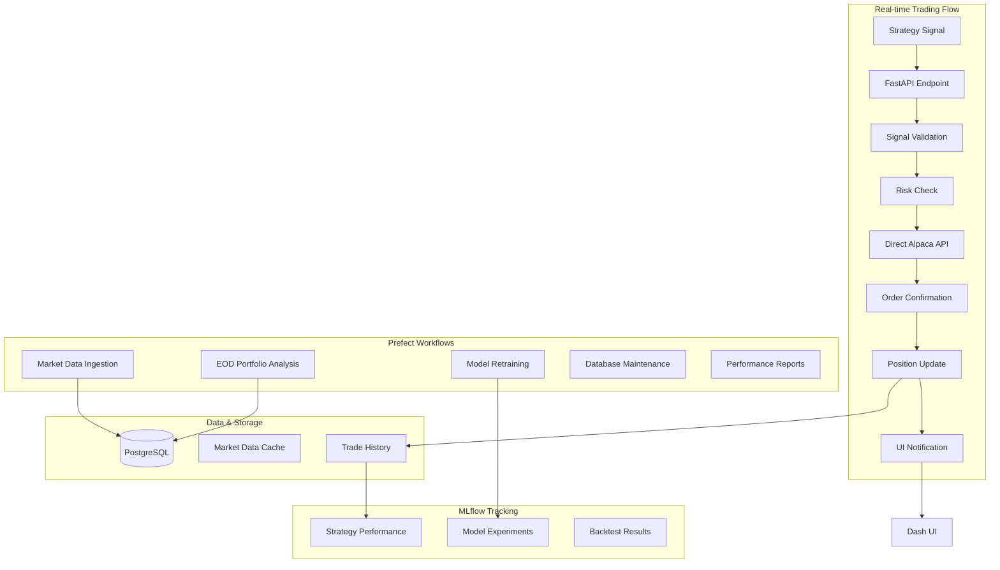

# 🏗️ Trading System Architecture Design

## 📋 **Overview**

This document outlines the architecture for a configurable trading system that integrates with existing ML Trading Dashboard infrastructure. The system is designed for flexibility, allowing signals from any strategy while maintaining robust risk management and execution capabilities.

---

## 🎯 **Design Principles**

### **Core Requirements**
- **Signal Agnostic**: Accept trading signals from any strategy or external source
- **Real-time Execution**: Fast signal-to-order execution (< 100ms target)
- **Risk Management**: Built-in position sizing and portfolio risk controls
- **Configuration-Driven**: Easy modification without code changes
- **Monitoring & Tracking**: Comprehensive logging and performance tracking
- **Paper & Live Trading**: Support both testing and live execution modes

### **Technology Stack**
- **Trading Broker**: Alpaca API for order execution
- **API Framework**: FastAPI for REST endpoints and WebSocket communication
- **Workflow Orchestration**: Prefect for data pipelines and scheduled jobs
- **ML Tracking**: MLflow for strategy experiments and model versioning
- **UI Integration**: Enhanced Dash dashboard with real-time updates
- **Database**: PostgreSQL (existing) with trading-specific tables

---

## 🔄 **Architecture Overview**

### **System Flow Diagram**


### **Component Separation**

| Component | Tool | Purpose | Latency Requirement |
|-----------|------|---------|-------------------|
| **Signal Processing** | FastAPI | Real-time trade execution | < 100ms |
| **Data Ingestion** | Prefect | Market data collection | Minutes |
| **Risk Management** | FastAPI | Position validation | < 50ms |
| **Order Execution** | Alpaca API | Direct trading | < 200ms |
| **Portfolio Analysis** | Prefect | EOD processing | Hours |
| **Model Training** | Prefect + MLflow | Strategy optimization | Hours/Days |
| **UI Updates** | WebSocket | Real-time monitoring | < 1s |

---

## 🛠️ **Core Components**

### 1. **Trading Signal Interface**

```python
# Core signal data structure
class TradingSignal:
    symbol: str                    # Stock symbol (e.g., "AAPL")
    action: str                    # "BUY", "SELL", "HOLD"
    quantity: Optional[int]        # Shares (if None, use position sizing)
    price_target: Optional[float]  # Target price for limit orders
    stop_loss: Optional[float]     # Stop loss price
    take_profit: Optional[float]   # Take profit price
    confidence: float              # Signal confidence (0.0 - 1.0)
    strategy_id: str              # Originating strategy identifier
    timestamp: datetime           # Signal generation time
    metadata: dict                # Additional strategy-specific data
```

### 2. **FastAPI Trading Engine**

```python
# Real-time trading execution
@app.post("/signals/execute")
async def execute_trading_signal(signal: TradingSignalSchema):
    """Direct trading execution - optimized for speed"""
    
    # 1. Immediate validation (< 10ms)
    if not validate_signal(signal):
        raise HTTPException(400, "Invalid signal")
    
    # 2. Fast risk check (< 50ms)
    risk_result = risk_manager.quick_check(signal)
    if not risk_result.approved:
        return {"status": "rejected", "reason": risk_result.reason}
    
    # 3. Direct Alpaca order (< 200ms)
    order = alpaca.submit_order(
        symbol=signal.symbol,
        qty=risk_result.position_size,
        side=signal.action.lower(),
        type='market',
        time_in_force='day'
    )
    
    # 4. Immediate response
    await broadcast_to_ui(order)
    
    # 5. Background logging (non-blocking)
    asyncio.create_task(log_trade_async(order, signal))
    
    return {
        "status": "executed",
        "order_id": order.id,
        "execution_time": order.submitted_at
    }
```

### 3. **Prefect Data Workflows**

```python
# Market data pipeline
@flow(name="Market Data Pipeline")
def market_data_pipeline():
    """Continuous market data ingestion"""
    symbols = get_active_symbols_task()
    
    for symbol_batch in chunk_symbols(symbols, 50):
        fetch_market_data_task.submit(symbol_batch)
    
    cleanup_old_data_task()

# End of day processing
@flow(name="End of Day Processing", schedule="0 17 * * 1-5")
def eod_processing():
    """Daily portfolio analysis and rebalancing"""
    daily_pnl = calculate_daily_pnl_task()
    update_portfolio_metrics_task(daily_pnl)
    risk_report = generate_risk_report_task()
    
    if should_retrain_model(risk_report):
        trigger_model_retraining_task()
    
    generate_daily_report_task(daily_pnl, risk_report)
```

### 4. **MLflow Integration**

```python
# Strategy experiment tracking
class StrategyExperimentTracker:
    def log_strategy_run(self, strategy_name: str, config: dict, results: dict):
        """Log strategy execution to MLflow"""
        
        with mlflow.start_run(experiment_id=self.get_experiment_id()):
            # Log strategy parameters
            mlflow.log_params({
                "strategy_name": strategy_name,
                **config
            })
            
            # Log performance metrics
            mlflow.log_metrics({
                "profit_loss": results.get("pnl", 0),
                "return_pct": results.get("return_pct", 0),
                "trades_count": results.get("trades_count", 0),
                "success_rate": results.get("success_rate", 0)
            })
            
            # Log model artifacts
            if "model" in results:
                mlflow.sklearn.log_model(results["model"], "strategy_model")
```

---

## 📁 **Directory Structure**

```
src/
├── api/                      # FastAPI application
│   ├── __init__.py
│   ├── main.py              # FastAPI app setup
│   ├── routers/
│   │   ├── trading.py       # Real-time trading endpoints
│   │   ├── strategies.py    # Strategy management
│   │   ├── portfolio.py     # Portfolio status endpoints
│   │   └── websockets.py    # Real-time UI updates
│   ├── schemas/
│   │   ├── signals.py       # Pydantic signal schemas
│   │   ├── orders.py        # Order-related schemas
│   │   └── portfolio.py     # Portfolio schemas
│   └── middleware/
│       ├── auth.py          # Authentication middleware
│       └── logging.py       # Request logging
├── workflows/                # Prefect workflows
│   ├── __init__.py
│   ├── data_pipelines.py    # Market data ingestion
│   ├── eod_processing.py    # End-of-day workflows
│   ├── model_training.py    # ML model retraining
│   └── maintenance.py       # Database maintenance
├── ml/                       # MLflow integration
│   ├── __init__.py
│   ├── experiment_tracking.py
│   ├── model_registry.py
│   └── strategy_optimization.py
├── trading/                  # Core trading logic
│   ├── core/
│   │   ├── __init__.py
│   │   ├── signal.py        # TradingSignal class
│   │   ├── strategy.py      # Base strategy interface
│   │   └── exceptions.py    # Custom exceptions
│   ├── execution/
│   │   ├── __init__.py
│   │   ├── direct_executor.py    # Real-time execution
│   │   ├── paper_executor.py     # Paper trading
│   │   └── order_manager.py      # Order management
│   ├── risk/
│   │   ├── __init__.py
│   │   ├── risk_manager.py       # Risk validation
│   │   ├── position_sizer.py     # Position sizing
│   │   └── validators.py         # Risk validators
│   ├── strategies/
│   │   ├── __init__.py
│   │   ├── base.py              # Abstract strategy base
│   │   ├── technical/           # Technical strategies
│   │   └── ml/                  # ML-based strategies
│   └── portfolio/
│       ├── __init__.py
│       ├── portfolio_manager.py
│       └── performance_tracker.py
├── dashboard/                # Enhanced Dash UI
│   ├── layouts/
│   │   ├── trading_layout.py     # Trading dashboard
│   │   ├── strategy_layout.py    # Strategy management
│   │   └── portfolio_layout.py   # Portfolio monitoring
│   ├── callbacks/
│   │   ├── trading_callbacks.py  # Trading interactions
│   │   └── realtime_callbacks.py # Real-time updates
│   └── utils/
│       └── api_client.py         # FastAPI integration
└── config/
    ├── trading_config.yaml       # Trading parameters
    ├── risk_config.yaml          # Risk management rules
    ├── prefect_config.yaml       # Workflow configuration
    └── mlflow_config.yaml        # ML tracking settings
```

---

## ⚡ **Performance Requirements**

### **Latency Targets**
- **Signal Validation**: < 10ms
- **Risk Assessment**: < 50ms  
- **Order Execution**: < 200ms
- **Total Signal-to-Order**: < 300ms
- **UI Updates**: < 1 second
- **Database Logging**: Asynchronous (non-blocking)

### **Throughput Targets**
- **Concurrent Signals**: 100+ per second
- **Daily Orders**: 10,000+ orders
- **Real-time Updates**: 1,000+ UI connections
- **Data Ingestion**: 500+ symbols real-time

---

## 🔧 **Configuration Management**

### **Trading Configuration Example**
```yaml
# config/trading_config.yaml
execution:
  mode: "paper"              # paper, live
  broker: "alpaca"
  order_type: "market"       # market, limit
  time_in_force: "day"       # day, gtc, ioc, fok

risk_management:
  max_portfolio_risk: 0.05   # 5% max portfolio risk
  max_single_position: 0.10  # 10% max single position
  max_correlation: 0.7       # Max correlation between positions
  stop_loss_percent: 0.02    # 2% stop loss
  
strategies:
  - name: "moving_average_crossover"
    enabled: true
    max_position_size: 1000
    confidence_threshold: 0.75
  - name: "ml_lstm_strategy"  
    enabled: false
    max_position_size: 500
    confidence_threshold: 0.80

alpaca:
  base_url: "https://paper-api.alpaca.markets"  # paper trading
  # base_url: "https://api.alpaca.markets"      # live trading
  key_id: "${ALPACA_API_KEY}"
  secret_key: "${ALPACA_SECRET_KEY}"
```

---

## 🎯 **Use Case Matrix**

| Task | Tool | Reason | Latency |
|------|------|--------|---------|
| **Real-time Signal Processing** | FastAPI | Speed, immediate response | < 100ms |
| **Order Execution** | Direct Alpaca API | Reliability, low latency | < 200ms |
| **Market Data Ingestion** | Prefect | Scheduled, retry logic, monitoring | Minutes |
| **End-of-Day Analysis** | Prefect | Complex workflows, scheduling | Hours |
| **Model Retraining** | Prefect + MLflow | Long-running, experiment tracking | Hours |
| **Database Maintenance** | Prefect | Background, resource management | Hours |
| **Real-time UI Updates** | WebSocket | Low latency, user experience | < 1s |
| **Trade Logging** | Async Tasks | Non-blocking, background | N/A |
| **Portfolio Rebalancing** | Prefect | Complex logic, scheduled | Minutes |
| **Strategy Backtesting** | Prefect + MLflow | Resource intensive, tracking | Minutes |

---

## 🚀 **Implementation Phases**

### **Phase 1: Foundation (Weeks 1-2)**
**Goal**: Basic real-time trading capability

- [ ] FastAPI application setup with trading endpoints
- [ ] Direct Alpaca integration for paper trading
- [ ] Basic risk management validation
- [ ] Trading signal schema and validation
- [ ] Simple position tracking

**Deliverables**:
- Working signal submission endpoint
- Paper trading execution
- Basic risk checks
- Order confirmation responses

### **Phase 2: Data Infrastructure (Weeks 3-4)**  
**Goal**: Robust data processing and storage

- [ ] Prefect workflow infrastructure
- [ ] Market data ingestion pipelines
- [ ] Database schema for trading data
- [ ] Trade logging and audit trails
- [ ] Basic portfolio tracking

**Deliverables**:
- Automated market data collection
- Complete trade history storage
- Portfolio state tracking
- Data quality monitoring

### **Phase 3: UI Integration (Weeks 5-6)**
**Goal**: Real-time dashboard integration

- [ ] Enhanced Dash trading dashboard
- [ ] WebSocket real-time updates
- [ ] Strategy management interface
- [ ] Portfolio monitoring views
- [ ] Trade execution controls

**Deliverables**:
- Live trading dashboard
- Real-time order updates
- Portfolio performance views
- Strategy control interface

### **Phase 4: Advanced Features (Weeks 7-8)**
**Goal**: Production-ready capabilities

- [ ] MLflow strategy tracking integration
- [ ] Advanced risk management rules
- [ ] Strategy optimization workflows
- [ ] Performance analytics
- [ ] Live trading preparation

**Deliverables**:
- Complete strategy lifecycle management
- Advanced risk controls
- Performance optimization tools
- Production deployment readiness

---

## 🔍 **Alternative Architecture Considerations**

### **Message Queue Alternative**
Instead of direct API calls, could use message queues (Redis/RabbitMQ):

**Pros**:
- Decoupled architecture
- Built-in retry mechanisms
- Better scaling for high volume
- Event-driven design

**Cons**:
- Added latency (queue processing)
- Additional infrastructure complexity
- More potential failure points
- Harder to debug

**Recommendation**: Start with direct API calls, migrate to queues if volume requires it.

### **Microservices Alternative**
Split into separate services (Signal Processor, Risk Manager, Order Executor):

**Pros**:
- Independent scaling
- Technology flexibility
- Team ownership
- Fault isolation

**Cons**:
- Network latency between services
- Distributed system complexity
- More deployment overhead
- Harder local development

**Recommendation**: Start monolithic, extract services as complexity grows.

### **Event Sourcing Alternative**
Store all events (signals, orders, fills) as immutable event log:

**Pros**:
- Complete audit trail
- Easy to replay/debug
- Natural time-series analysis
- Excellent for compliance

**Cons**:
- Storage overhead
- Query complexity
- Eventual consistency issues
- Learning curve

**Recommendation**: Consider for Phase 4 if regulatory requirements demand it.

---

## 📊 **Monitoring & Observability**

### **Key Metrics to Track**
- **Latency**: Signal-to-order execution time
- **Throughput**: Orders per second, signals processed
- **Success Rate**: Order fill rate, signal accuracy
- **Risk Metrics**: Portfolio exposure, position concentration
- **Performance**: Strategy returns, Sharpe ratios
- **System Health**: API response times, error rates

### **Alerting Strategy**
- **Critical**: Order execution failures, risk limit breaches
- **Warning**: High latency, low fill rates, strategy underperformance
- **Info**: Daily summaries, portfolio updates

---

## 🎯 **Next Steps & Decision Points**

### **Immediate Decisions Needed**
1. **Implementation Phase**: Which phase should we start with?
2. **Trading Mode**: Begin with paper trading or simulation?
3. **Strategy Priority**: Which strategy types to implement first?
4. **Database Integration**: Extend existing schema or separate trading DB?
5. **Authentication**: How to secure trading endpoints?

### **Future Considerations**
1. **Scaling Strategy**: When to move to microservices?
2. **Cloud Deployment**: AWS/GCP for production?
3. **Regulatory Compliance**: What audit trails are needed?
4. **Multi-Broker Support**: Plans beyond Alpaca?
5. **International Markets**: Support for non-US exchanges?

---

## 💡 **Conclusion**

This architecture provides a solid foundation for a configurable trading system that balances speed requirements for real-time execution with robust data processing capabilities. The separation of concerns between FastAPI (real-time) and Prefect (batch/scheduled) ensures each tool is used for its strengths.

The modular design allows for incremental implementation and future scaling while maintaining integration with the existing ML Trading Dashboard infrastructure.

**Ready to proceed with Phase 1 implementation or would you like to explore any alternative approaches first?**