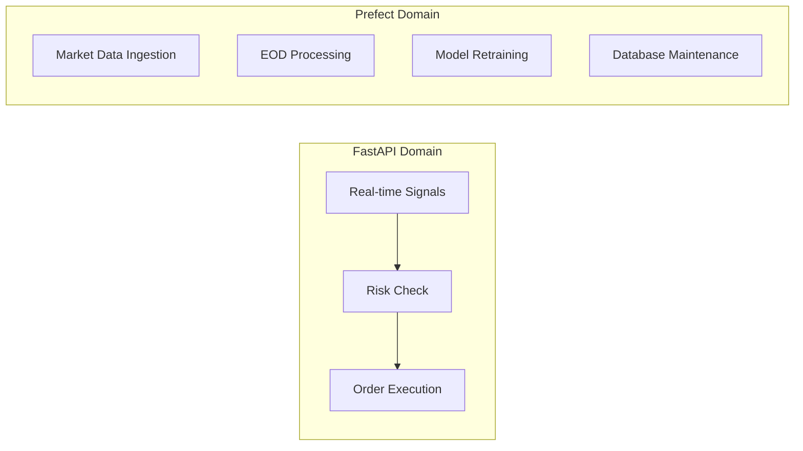

# 🎯 Trading System Design Considerations

## 📋 **Overview**

This document outlines key design decisions, trade-offs, and alternative approaches considered for the configurable trading system. It serves as a reference for understanding why certain architectural choices were made and when to reconsider them.

---

## 🏗️ **Core Architectural Decisions**

### 1. **Real-time Execution: Direct API vs Message Queues**

#### **Chosen Approach: Direct FastAPI → Alpaca API**

```python
# Direct execution flow
@app.post("/signals/execute")
async def execute_signal(signal: TradingSignal):
    risk_result = risk_manager.validate(signal)    # < 50ms
    order = alpaca.submit_order(...)               # < 200ms
    return {"status": "executed", "order_id": order.id}
```

#### **Alternative: Redis Message Queue**

```python
# Queue-based flow
@app.post("/signals/submit")
async def submit_signal(signal: TradingSignal):
    redis.lpush("trading_signals", signal.json())  # < 5ms
    return {"status": "queued", "signal_id": signal.id}

# Separate worker process
async def process_signals():
    while True:
        signal = redis.brpop("trading_signals")
        execute_trade(signal)
```

#### **Decision Matrix**

| Factor | Direct API | Redis Queue | Winner |
|--------|------------|-------------|--------|
| **Latency** | 250ms total | 300ms+ total | ✅ Direct |
| **Simplicity** | Simple | Complex | ✅ Direct |
| **Reliability** | Direct dependency | Additional failure point | ✅ Direct |
| **Scalability** | Limited | High | ❌ Direct |
| **Infrastructure** | None | Redis cluster | ✅ Direct |
| **Development Speed** | Fast | Slower | ✅ Direct |

#### **When to Reconsider Redis**
- **Signal volume** > 100/minute
- **Multiple strategy sources** requiring aggregation
- **Complex routing logic** needed
- **Signal buffering** requirements
- **Priority queuing** needed

---

### 2. **Workflow Orchestration: Prefect Usage Scope**

#### **Chosen Approach: Prefect for Data/Maintenance, FastAPI for Trading**



#### **Alternative: Prefect for Everything**

```python
# Everything as Prefect flows
@flow(name="Signal Processing")
def process_signal_flow(signal_data):
    validated_signal = validate_signal_task(signal_data)
    risk_result = assess_risk_task(validated_signal)
    execution_result = execute_trade_task(validated_signal)
    return execution_result
```

#### **Decision Rationale**

| Use Case | Tool Choice | Reasoning |
|----------|-------------|-----------|
| **Trading Execution** | FastAPI | Speed requirement (< 300ms) |
| **Data Pipelines** | Prefect | Batch processing, retry logic |
| **Model Training** | Prefect | Long-running, resource intensive |
| **Maintenance Jobs** | Prefect | Scheduled, background tasks |
| **Real-time UI** | WebSocket | Low latency updates |

#### **Prefect Strengths for Data Workflows**
- ✅ **Retry Logic**: Automatic failure recovery
- ✅ **Scheduling**: Cron-like job scheduling
- ✅ **Monitoring**: Built-in observability
- ✅ **Resource Management**: Memory/CPU controls
- ✅ **Dependency Management**: Task orchestration

#### **Prefect Weaknesses for Trading**
- ❌ **Latency Overhead**: Task submission/execution
- ❌ **Complexity**: Unnecessary for simple operations
- ❌ **Additional Dependencies**: Worker processes, database

---

### 3. **Database Strategy: Extend vs Separate**

#### **Chosen Approach: Extend Existing PostgreSQL**

```sql
-- Add trading tables to existing schema
CREATE TABLE trading_signals (
    id SERIAL PRIMARY KEY,
    symbol VARCHAR(10) NOT NULL,
    action VARCHAR(10) NOT NULL,
    strategy_id VARCHAR(50) NOT NULL,
    created_at TIMESTAMP DEFAULT NOW()
);

CREATE TABLE trading_orders (
    id SERIAL PRIMARY KEY,
    signal_id INTEGER REFERENCES trading_signals(id),
    alpaca_order_id VARCHAR(50) UNIQUE,
    status VARCHAR(20) NOT NULL,
    executed_at TIMESTAMP
);
```

#### **Alternative: Separate Trading Database**

```python
# Separate database connections
market_db = PostgreSQLConnection("market_data_db")
trading_db = PostgreSQLConnection("trading_db")
```

#### **Decision Factors**

| Factor | Extend Existing | Separate DB | Choice |
|--------|-----------------|-------------|--------|
| **Complexity** | Low | Medium | ✅ Extend |
| **Data Consistency** | High | Requires coordination | ✅ Extend |
| **Performance** | Shared resources | Dedicated | ⚖️ Depends |
| **Backup Strategy** | Unified | Separate strategies | ✅ Extend |
| **Cross-references** | Easy JOINs | Complex queries | ✅ Extend |

---

### 4. **Risk Management: Real-time vs Batch**

#### **Chosen Approach: Hybrid - Fast Checks + Detailed Analysis**

```python
class RiskManager:
    def quick_check(self, signal: TradingSignal) -> QuickRiskResult:
        """Fast risk validation for real-time execution"""
        # In-memory checks only (< 50ms)
        position_size = self.calculate_position_size(signal)
        portfolio_risk = self.get_cached_portfolio_risk()
        
        return QuickRiskResult(
            approved=position_size > 0 and portfolio_risk < 0.05,
            position_size=position_size,
            reason="Quick validation"
        )
    
    def detailed_analysis(self, signal: TradingSignal) -> DetailedRiskResult:
        """Comprehensive risk analysis (background)"""
        # Database queries, complex calculations
        correlation_analysis = self.analyze_correlations(signal.symbol)
        stress_test = self.run_stress_scenarios(signal)
        
        return DetailedRiskResult(
            correlation_risk=correlation_analysis,
            stress_test_results=stress_test
        )
```

#### **Alternative: Always Detailed Analysis**

```python
def comprehensive_risk_check(signal: TradingSignal) -> RiskResult:
    """Always run full analysis (slower)"""
    # 500ms+ for complete analysis
    position_analysis = self.analyze_position_impact(signal)
    portfolio_analysis = self.analyze_portfolio_risk(signal)
    correlation_analysis = self.analyze_correlations(signal)
    
    return RiskResult(...)
```

#### **Hybrid Approach Benefits**
- ✅ **Fast execution** for real-time trading
- ✅ **Comprehensive analysis** for important decisions
- ✅ **Background refinement** of risk models
- ✅ **Configurable thresholds** for detailed analysis triggers

---

### 5. **Strategy Integration: Plugin vs Hardcoded**

#### **Chosen Approach: Plugin-based Strategy Framework**

```python
# Abstract base class
class TradingStrategy(ABC):
    @abstractmethod
    def generate_signal(self, market_data) -> TradingSignal:
        pass
    
    @abstractmethod
    def get_config_schema(self) -> dict:
        pass

# Dynamic registration
class StrategyManager:
    def __init__(self):
        self.strategies = {}
    
    def register_strategy(self, name: str, strategy_class: Type[TradingStrategy]):
        self.strategies[name] = strategy_class
    
    def load_from_config(self, config_path: str):
        config = yaml.load(open(config_path))
        for strategy_config in config['strategies']:
            strategy_class = import_class(strategy_config['class'])
            self.register_strategy(strategy_config['name'], strategy_class)
```

#### **Alternative: Hardcoded Strategy Integration**

```python
# Fixed strategy implementations
if strategy_type == "moving_average":
    signal = MovingAverageStrategy().generate_signal(data)
elif strategy_type == "rsi":
    signal = RSIStrategy().generate_signal(data)
elif strategy_type == "ml_lstm":
    signal = LSTMStrategy().generate_signal(data)
```

#### **Plugin Benefits**
- ✅ **Flexibility**: Add strategies without code changes
- ✅ **Testing**: Easy to test individual strategies
- ✅ **Configuration**: YAML-driven strategy parameters
- ✅ **Modularity**: Clear separation of concerns
- ✅ **Extensibility**: Third-party strategy integration

---

### 6. **Error Handling: Fail Fast vs Graceful Degradation**

#### **Chosen Approach: Contextual Error Handling**

```python
class TradingExecutor:
    async def execute_signal(self, signal: TradingSignal) -> ExecutionResult:
        try:
            # Critical path - fail fast
            risk_result = self.risk_manager.validate(signal)
            if not risk_result.approved:
                return ExecutionResult(status="rejected", reason=risk_result.reason)
            
            # Trading execution - retry with circuit breaker
            order = await self.execute_with_retry(signal, risk_result)
            
            # Non-critical logging - graceful degradation
            try:
                await self.log_execution(order)
            except Exception as e:
                logger.warning(f"Logging failed: {e}")  # Don't fail the trade
            
            return ExecutionResult(status="executed", order=order)
            
        except CriticalTradingError as e:
            # Fail fast for critical errors
            raise HTTPException(500, f"Trading execution failed: {e}")
        except Exception as e:
            # Graceful degradation for unexpected errors
            logger.error(f"Unexpected error: {e}")
            return ExecutionResult(status="error", reason=str(e))
```

#### **Error Handling Strategy**

| Component | Strategy | Reasoning |
|-----------|----------|-----------|
| **Signal Validation** | Fail Fast | Invalid signals should not proceed |
| **Risk Checks** | Fail Fast | Risk violations must stop execution |
| **Order Execution** | Retry + Circuit Breaker | Network issues are temporary |
| **Logging** | Graceful Degradation | Don't fail trades for logging issues |
| **UI Updates** | Best Effort | User experience, not critical |

---

### 7. **Performance vs Maintainability Trade-offs**

#### **Chosen Approach: Maintainability First, Optimize Later**

```python
# Readable, maintainable code
class PositionSizer:
    def calculate_position_size(self, signal: TradingSignal, portfolio: Portfolio) -> int:
        """Calculate position size using Kelly Criterion with risk limits"""
        
        # Clear, readable implementation
        kelly_fraction = self._calculate_kelly_fraction(signal)
        risk_adjusted_fraction = min(kelly_fraction, self.max_position_risk)
        portfolio_value = portfolio.get_total_value()
        
        raw_position_value = portfolio_value * risk_adjusted_fraction
        shares = int(raw_position_value / signal.price)
        
        return min(shares, self.max_shares_per_position)
    
    def _calculate_kelly_fraction(self, signal: TradingSignal) -> float:
        """Kelly Criterion: f = (bp - q) / b"""
        win_probability = signal.confidence
        loss_probability = 1 - win_probability
        win_loss_ratio = signal.expected_return / abs(signal.expected_loss)
        
        kelly_fraction = (win_probability * win_loss_ratio - loss_probability) / win_loss_ratio
        return max(0, kelly_fraction)  # Never go negative
```

#### **Alternative: Performance-Optimized**

```python
# Optimized but less readable
class FastPositionSizer:
    def __init__(self):
        self._cached_calculations = {}
        self._vectorized_kelly = np.vectorize(self._kelly_calc)
    
    def calculate_batch_sizes(self, signals: List[TradingSignal]) -> List[int]:
        # Vectorized calculations for speed
        confidences = np.array([s.confidence for s in signals])
        returns = np.array([s.expected_return for s in signals])
        
        kelly_fractions = self._vectorized_kelly(confidences, returns)
        # ... complex optimized calculations
```

#### **Performance Philosophy**
1. **Start with readable code** that works correctly
2. **Measure performance** with real data
3. **Optimize bottlenecks** identified by profiling
4. **Maintain readability** where performance isn't critical

---

### 8. **Configuration Management: Static vs Dynamic**

#### **Chosen Approach: Hybrid Configuration**

```yaml
# Static configuration (requires restart)
execution:
  broker: "alpaca"
  mode: "paper"  # paper, live
  
risk_management:
  max_portfolio_risk: 0.05
  max_single_position: 0.10

# Dynamic configuration (runtime updates)
strategies:
  - name: "moving_average"
    enabled: true              # Can be toggled
    confidence_threshold: 0.75  # Can be adjusted
    max_position_size: 1000    # Can be modified
```

```python
class ConfigManager:
    def __init__(self):
        self.static_config = yaml.load(open("trading_config.yaml"))
        self.dynamic_config = self.load_dynamic_config()
    
    def update_strategy_config(self, strategy_name: str, updates: dict):
        """Update strategy configuration at runtime"""
        strategy_config = self.get_strategy_config(strategy_name)
        strategy_config.update(updates)
        self.save_dynamic_config()
        
        # Notify strategy of config change
        strategy = self.strategy_manager.get_strategy(strategy_name)
        strategy.update_config(strategy_config)
```

#### **Configuration Categories**

| Type | Examples | Update Method | Restart Required |
|------|----------|---------------|------------------|
| **Static** | Broker settings, database URLs | File edit | ✅ Yes |
| **Dynamic** | Strategy parameters, thresholds | API/UI | ❌ No |
| **Runtime** | Strategy enabled/disabled | UI toggle | ❌ No |

---

### 9. **Testing Strategy: Unit vs Integration vs End-to-End**

#### **Chosen Approach: Pyramid Testing Strategy**

```
     /\     E2E Tests (Few)
    /  \    - Full system workflows
   /____\   - Paper trading scenarios
  /      \  
 / Unit   \ Integration Tests (Some)
/__Tests__\ - API + Database
(Many)      - Strategy + Risk Manager
            - FastAPI + Alpaca (mocked)
```

#### **Testing Implementation**

```python
# Unit Tests (Fast, Many)
class TestRiskManager:
    def test_position_sizing_within_limits(self):
        risk_manager = RiskManager(max_position_risk=0.1)
        signal = TradingSignal(symbol="AAPL", confidence=0.8)
        result = risk_manager.calculate_position_size(signal, mock_portfolio)
        assert result <= mock_portfolio.value * 0.1

# Integration Tests (Medium, Some)
class TestTradingAPI:
    def test_signal_execution_workflow(self, test_client, mock_alpaca):
        response = test_client.post("/signals/execute", json=test_signal)
        assert response.status_code == 200
        assert mock_alpaca.submit_order.called

# E2E Tests (Slow, Few)
class TestPaperTrading:
    def test_complete_trading_workflow(self, live_system):
        # Submit signal through UI
        # Verify execution in Alpaca paper account
        # Check portfolio updates
        pass
```

---

### 10. **Monitoring & Observability: Custom vs Third-party**

#### **Chosen Approach: Built-in Monitoring + Optional Third-party**

```python
# Built-in metrics collection
class TradingMetrics:
    def __init__(self):
        self.execution_times = []
        self.success_rates = {}
        self.risk_violations = 0
    
    def record_execution(self, signal: TradingSignal, execution_time_ms: int, success: bool):
        self.execution_times.append(execution_time_ms)
        strategy_id = signal.strategy_id
        
        if strategy_id not in self.success_rates:
            self.success_rates[strategy_id] = {"successes": 0, "total": 0}
        
        self.success_rates[strategy_id]["total"] += 1
        if success:
            self.success_rates[strategy_id]["successes"] += 1
    
    def get_performance_summary(self) -> dict:
        return {
            "avg_execution_time": np.mean(self.execution_times),
            "p95_execution_time": np.percentile(self.execution_times, 95),
            "strategy_success_rates": {
                k: v["successes"] / v["total"] 
                for k, v in self.success_rates.items()
            }
        }

# Optional: Prometheus/Grafana integration
class PrometheusMetrics:
    def __init__(self):
        self.execution_time = Histogram('trading_execution_seconds')
        self.success_rate = Counter('trading_executions_total')
    
    def record_execution(self, execution_time: float, success: bool):
        self.execution_time.observe(execution_time)
        self.success_rate.labels(status='success' if success else 'failure').inc()
```

#### **Monitoring Philosophy**
- ✅ **Start simple**: Built-in metrics and logging
- ✅ **Essential metrics**: Latency, success rate, risk violations
- ✅ **Dashboard integration**: Display in existing Dash UI
- ✅ **Optional scaling**: Add Prometheus/Grafana later if needed

---

## 🔄 **Evolution Strategy**

### **Phase 1: Minimal Viable Product**
- Direct FastAPI → Alpaca execution
- Basic risk management
- Simple configuration
- Built-in monitoring

### **Phase 2: Production Hardening**
- Enhanced error handling
- Comprehensive testing
- Performance monitoring
- Security hardening

### **Phase 3: Scale & Optimize**
- Consider Redis if volume requires
- Microservices if complexity grows
- Advanced monitoring if needed
- Multi-broker support

### **Phase 4: Advanced Features**
- Machine learning integration
- Real-time risk adjustment
- Advanced portfolio optimization
- Regulatory compliance features

---

## 📊 **Decision Framework**

### **When to Add Complexity**

| Complexity | Add When | Current State | Threshold |
|------------|----------|---------------|-----------|
| **Redis Queue** | > 100 signals/minute | Personal trading | Keep simple |
| **Microservices** | > 3 developers | Solo project | Keep monolithic |
| **Event Sourcing** | Regulatory audit needs | Personal use | Keep simple |
| **Circuit Breakers** | Frequent API failures | Stable Alpaca API | Monitor first |
| **Load Balancing** | > 1000 concurrent users | Single user | Not needed |

### **Optimization Triggers**

| Metric | Current Target | Optimization Trigger | Action |
|--------|----------------|---------------------|--------|
| **Execution Latency** | < 300ms | > 500ms consistently | Profile & optimize |
| **Success Rate** | > 95% | < 90% | Improve error handling |
| **Memory Usage** | < 1GB | > 2GB | Optimize algorithms |
| **CPU Usage** | < 50% | > 80% | Add caching/optimization |

---

## 💡 **Key Takeaways**

### **Design Principles**
1. **Start Simple**: Choose the simplest solution that meets requirements
2. **Measure First**: Get real performance data before optimizing
3. **Fail Fast**: For critical errors, graceful degradation for others
4. **Configuration-Driven**: Make behavior configurable without code changes
5. **Monitoring Built-in**: Include observability from day one

### **When to Reconsider Decisions**
- **Volume Growth**: Current approach can't handle load
- **New Requirements**: Use cases not considered in original design
- **Performance Issues**: Bottlenecks identified through monitoring
- **Operational Pain**: Manual processes that should be automated
- **Team Growth**: Architecture doesn't support multiple developers

### **Success Metrics**
- **Reliability**: > 95% successful signal execution
- **Performance**: < 300ms average execution time
- **Maintainability**: New features can be added quickly
- **Observability**: Can diagnose issues within minutes
- **Flexibility**: Strategy changes don't require code deployment

---

## 🚀 **Conclusion**

This design prioritizes **simplicity and maintainability** while keeping the door open for future scaling. The architecture can evolve incrementally based on real usage patterns and performance data rather than premature optimization.

The key insight is that for personal trading systems, **the complexity of high-frequency trading infrastructure is likely overkill**. Start with a solid, simple foundation and add complexity only when clear evidence shows it's needed.

**Next Steps**: Begin with Phase 1 implementation using the simple, direct approach documented in the main architecture guide.