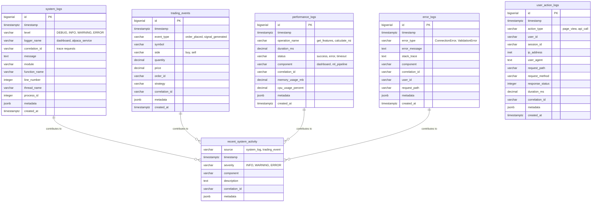

# 🔗 Database Entity Relationship Diagrams

## High-Level System Architecture

```mermaid
graph TB
    subgraph "Market Data Layer"
        SI[stock_info<br/>📊 Symbol Metadata]
        MD[market_data<br/>📈 OHLCV Data<br/>1.9M+ records]
        FED[feature_engineered_data<br/>🧠 ML Features<br/>100+ columns]
        MV[mv_features_dashboard_summary<br/>⚡ Dashboard Cache]
    end
    
    subgraph "Trading Layer"
        M[models<br/>🤖 ML Models]
        P[predictions<br/>🎯 Model Outputs]
        O[orders<br/>📋 Trade Orders]
        F[fills<br/>✅ Executions]
    end
    
    subgraph "Monitoring Layer"
        SL[system_logs<br/>📝 App Logs]
        TL[trading_events<br/>💰 Trade Events]
        PL[performance_logs<br/>⚡ Metrics]
        EL[error_logs<br/>❌ Errors]
        UAL[user_action_logs<br/>👤 User Activity]
    end
    
    subgraph "Views"
        RSA[recent_system_activity<br/>📊 Unified Activity]
    end
    
    %% Data Flow Relationships
    SI -->|enriches| MD
    MD -->|transforms to| FED
    FED -->|aggregates to| MV
    
    M -->|generates| P
    FED -.->|feeds| P
    P -.->|triggers| O
    O -->|executes as| F
    
    %% Logging Relationships
    SL -->|feeds| RSA
    TL -->|feeds| RSA
    PL -->|feeds| RSA
    EL -->|feeds| RSA
    
    %% Style
    classDef marketData fill:#e1f5fe
    classDef trading fill:#f3e5f5
    classDef logging fill:#fff3e0
    classDef views fill:#e8f5e8
    
    class SI,MD,FED,MV marketData
    class M,P,O,F trading
    class SL,TL,PL,EL,UAL logging
    class RSA views
```



## Detailed Entity Relationships

### Market Data Domain

```mermaid
erDiagram
    stock_info ||--o{ market_data : "has market data for"
    market_data ||--|| feature_engineered_data : "transforms to features"
    feature_engineered_data }o--|| mv_features_dashboard_summary : "aggregates to"
    
    stock_info {
        bigserial id PK
        varchar symbol UK "AAPL, GOOGL, etc"
        varchar company_name
        varchar sector "Technology, Healthcare"
        varchar industry
        bigint market_cap
        varchar country
        varchar currency
        varchar exchange
        varchar source "yahoo"
        timestamp created_at
        timestamp updated_at
    }
    
    market_data {
        bigserial id PK
        varchar symbol FK "References stock_info"
        timestamp timestamp
        decimal open
        decimal high
        decimal low
        decimal close
        bigint volume
        varchar source "yahoo, alpaca"
        timestamp created_at
        unique_constraint "symbol+timestamp+source"
    }
    
    feature_engineered_data {
        serial id PK
        varchar symbol
        timestamp timestamp
        double_precision open
        double_precision high
        double_precision low
        double_precision close
        double_precision volume
        double_precision returns
        double_precision rsi_1d
        double_precision price_ma_short
        double_precision bb_upper
        double_precision macd
        double_precision atr
        varchar feature_version "3.0"
        timestamp created_at
        timestamp updated_at
        unique_constraint "symbol+timestamp+source"
    }
    
    mv_features_dashboard_summary {
        varchar symbol PK
        timestamp latest_timestamp
        bigint total_records
        varchar latest_version
        float rsi_coverage
        float ma_coverage
    }
```

### Trading Domain


### Logging Domain



## Data Flow Patterns

### 1. Market Data Ingestion Flow


### 2. ML Prediction Flow


### 3. System Monitoring Flow


## Key Constraints and Relationships

### Primary Keys
- All tables use `BIGSERIAL` for high-volume data handling
- `feature_engineered_data` uses `SERIAL` (sufficient for current volume)

### Foreign Key Relationships
- `fills.order_id` → `orders.order_id` (CASCADE DELETE)
- `predictions.model_id` → `models.model_id` (RESTRICT DELETE)

### Unique Constraints
- `market_data`: (symbol, timestamp, source)
- `feature_engineered_data`: (symbol, timestamp, source)
- `stock_info`: symbol

### Indexes (Performance Optimized ✅)
- **Primary indexes**: symbol+version+timestamp patterns
- **Covering indexes**: Include commonly queried columns
- **Partial indexes**: Recent data and market hours
- **Composite indexes**: Multi-column query patterns

## Data Volume & Growth Patterns

### Current State
- **feature_engineered_data**: 1.9M records (primary growth driver)
- **market_data**: High-frequency ingestion (hourly updates)
- **system_logs**: Moderate volume (application logging)
- **predictions**: Growing with ML model usage

### Growth Projections
- **feature_engineered_data**: ~2M records/year (1K symbols × 2K hours/year)
- **market_data**: ~500K records/year (base OHLCV data)
- **Logging tables**: ~10M records/year (system monitoring)

### Scaling Considerations
- **Partitioning**: Consider date-based partitioning for large tables
- **Archival**: Implement automated archival policies
- **Read Replicas**: Separate read/write workloads for high traffic